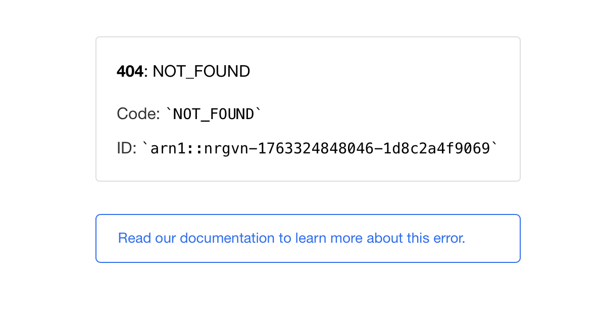
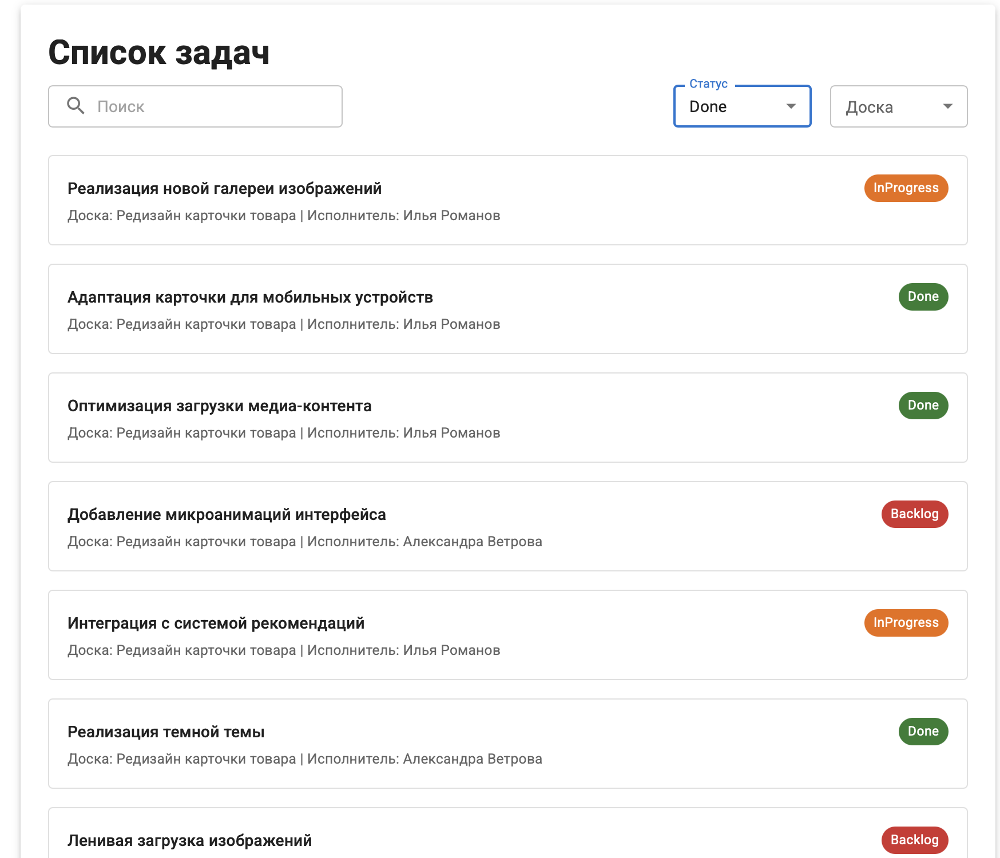
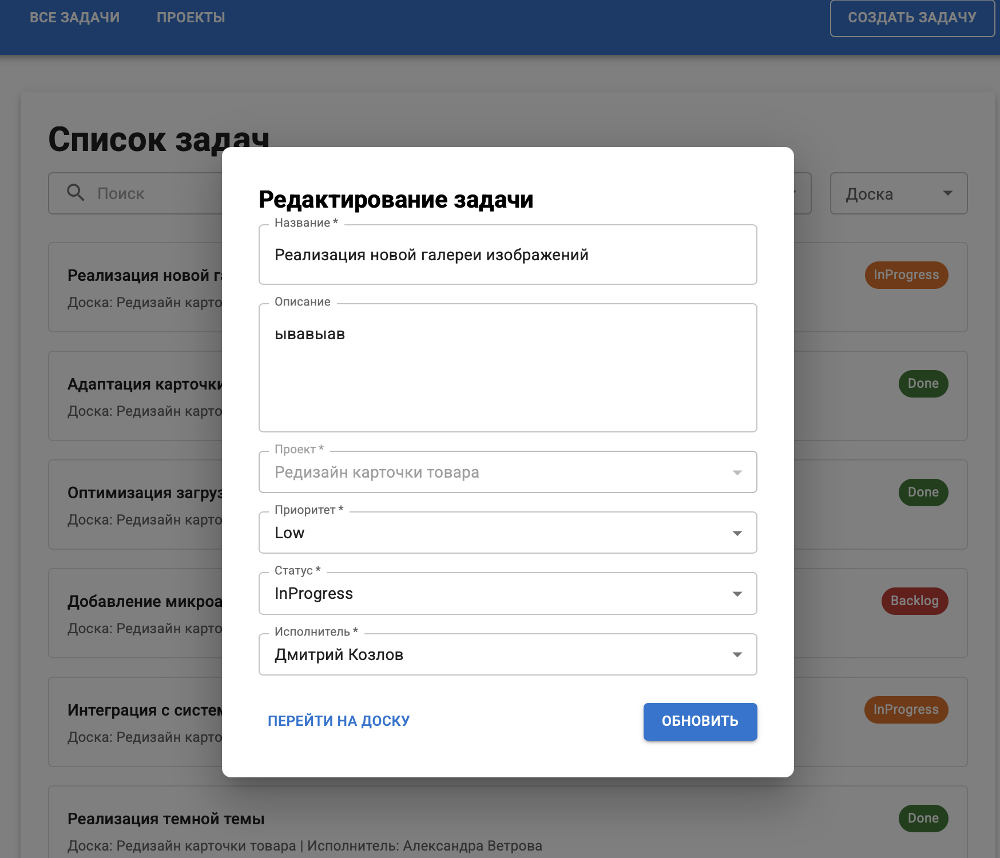

## Баг-репорт для задания 2

___
### №1

#### Заголовок - Перезагрузка страницы возвращает 404 ошибку
#### Приоритет и серьезность - high, critical
#### Стенд - https://avito-tech-internship-psi.vercel.app

#### Предусловия - открыта главная страница в браузере Chrome или Firefox

#### Шаги:
1. Перезагрузить главную страницу

#### Ожидаемый результат - Главная страница успешно загружается

#### Фактический результат - 404 ошибка

___
### №2

#### Заголовок - Фильтр "Done" по статусу проекта отображает все результаты со всеми статусами
#### Тест-кейс №3
#### Приоритет и серьезность - high, high
#### Стенд - https://avito-tech-internship-psi.vercel.app

#### Предусловия - открыта главная страница в браузере Chrome или Firefox

#### Шаги:
1. Нажать на выпадающий список "_**Статус**_"
2. Выбрать статус "_**Done**_"

#### Ожидаемый результат - В списке задач отображаются задачи только со статусом "Done"

#### Фактический результат - В списке задач отображаются абсолютно все задачи со всеми статусами

___

### №3

#### Заголовок - Возможность обновить задачу не обновляет её
#### Тест-кейс №8
#### Приоритет и серьезность - high, high
#### Стенд - https://avito-tech-internship-psi.vercel.app

#### Предусловия - открыта главная страница в браузере Chrome или Firefox

#### Шаги:
1. Создать задачу с выбранным проектом "_**Оптимизация производительности**_"
2. Найти задачу, которую создали
3. Нажать на задачу, которую хотим обновить
4. Ввести в поле "Название" значение "_**Обновленная задача**_"
5. Выбрать приоритет "**_Low_**" (аналогично для "Medium" и "High")
6. Выбрать статус "Backlog"
7. Выбрать исполнителя "**_Дмитрий Козлов_**"
8. Нажать на кнопку "**_ОБНОВИТЬ_**"
9. Проверить, что задача появилась в списке

#### Ожидаемый результат - В задаче обновилось название, приоритет и исполнитель. Обновленная задача с новым именем отображается в списке задач

#### Фактический результат - Задача не обновляет название и статус (в случае, если выбрать статус "Backlog")

#### До обновления

#### После обновления
